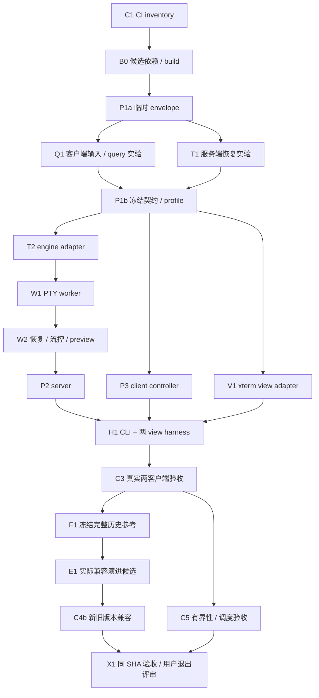

# M0：终端与协议风险闭环

状态：**待用户评审汇总 DAG 并批准实施**。本地实验边界已获批准；本文和关联 Issue 的建立、审查及合入只完成 planning，不授权功能派发。

计划基线：`1e1398462c2aadc5a9171e40aef7c5d9f0ad3da7`。父任务 [#5](https://github.com/GhostFlying/cove/issues/5)，[GitHub M0 milestone](https://github.com/GhostFlying/cove/milestone/1)。模块计划分别为 [协议/server/client/CLI](../plans/m0-protocol.md)、[终端 engine/worker](../plans/m0-terminal.md)、[CI 与 A0–A9 验收](../plans/m0-ci.md)。实施派发顺序和模块任务映射以本文为准；产品决策仍以既有设计文档为准。

## 交付范围

在 macOS/Linux 上运行独立 Node server、PTY worker 和完整 CLI，两个浏览器测试 view 连接同一个真实 PTY。验证切换操作者/尺寸、查询唯一回复、断线恢复、有限历史/reflow、多客户端流控和同协议跨 build 兼容。所有客户端断开后，原 server 内 PTY 继续运行。

用户已接受本地实验：数字 loopback、每次启动的短期凭据、实例内操作记录。持久化属于 M1，正式设备配对/远程接入属于 M2。两个测试页面不是二期 Web App，也不是提前实现 Electron/RN 产品。M0 不实现 task/workspace、SQLite、keeper、tsnet、迁移、chat、定时任务、Shepherd 或 agent hook。

M0 即采集完整链路延迟与资源数据，但不把 100 个真实 agent 的容量资格提前作为退出条件；该目标保留在 M4。普通库版本/字段/队列数值由实验收敛，改变已接受行为或缩减必需恢复场景才交用户决策。

## 依赖图与执行批次

以下边表示任务验收前置条件。契约 fixture 允许 P3/V1 独立实现，不代表真实联调已经通过。所有实现都还受共同的“用户批准 M0”前置约束。

- **批次 1：建立可信实验入口。** C1 首先接 CI inventory，然后 B0/P1a 为实验提供真实依赖和有界接口；B0 不等待最终 profile，C2 也不是风险实验前置条件。
- **批次 2：并行消除两侧风险。** Q1 与 T1 分开验证客户端输入来源、服务端恢复后继续解析。必需场景失败阻塞 P1b；提出具体反例和维护成本，交用户决策，不能以 unsupported/unavailable 规避。
- **批次 3：按冻结契约分头实现。** engine/worker 路径、公共 controller 和 xterm view 并行。T3/T4/T5 同目录写入串行；P2 完整验收等 worker 状态/预览服务。原生集成任务同一时间最多一个。
- **批次 4：操作与验证闭环。** H1 完整 CLI 和两 view；C3 验证真实集成，再并行冻结/测试跨版本与资源边界，最后 X1 汇总同一 main SHA 的跨平台证据。

批次是当前 milestone 内工程调度，不是新增用户审批点。普通 PR 可在用户批准 M0 后按既定权限自主合并；阶段退出与 M1 进入仍需用户 review/许可。

## 可派发任务及所有权

每个 Issue 都标记 proposed/blocked on M0 entry。角色名只是领域 owner；实际 agent/session、模型、worktree、可写路径、head/base、依赖已合入 SHA 在派发时记录。禁止依赖其他 checkout 未提交文件。

| ID / Issue                                               | 交付                                                | 前置        | 唯一写入领域                                                             |
| -------------------------------------------------------- | --------------------------------------------------- | ----------- | ------------------------------------------------------------------------ |
| [C1 #9](https://github.com/GhostFlying/cove/issues/9)    | CI inventory and fail-closed gates                  | 用户批准 M0 | `.github/workflows/**, tooling gate tests`                               |
| [B0 #10](https://github.com/GhostFlying/cove/issues/10)  | Candidate dependencies and build boundaries         | C1          | `root/package manifests, pnpm-lock.yaml, tsconfig/exports`               |
| [P1a #11](https://github.com/GhostFlying/cove/issues/11) | Provisional protocol and pipe envelopes             | B0          | `packages/protocol/**`                                                   |
| [Q1 #12](https://github.com/GhostFlying/cove/issues/12)  | Client query suppression and input provenance probe | B0, P1a     | `packages/terminal-web/probes/**, tests/fixtures/terminal/client/**`     |
| [T1 #13](https://github.com/GhostFlying/cove/issues/13)  | Terminal recovery and continuation probe            | B0, P1a     | `packages/terminal-engine/probes/**, tests/fixtures/terminal/engine/**`  |
| [P1b #14](https://github.com/GhostFlying/cove/issues/14) | Freeze supported terminal and pipe contracts        | P1a, Q1, T1 | `packages/protocol/**, profile fixtures`                                 |
| [T2 #15](https://github.com/GhostFlying/cove/issues/15)  | Authoritative terminal engine adapter               | P1b         | `packages/terminal-engine/src/**`                                        |
| [W1 #16](https://github.com/GhostFlying/cove/issues/16)  | Ordered PTY worker execution                        | T2, P1b     | `packages/terminal-worker/src/**`                                        |
| [W2 #17](https://github.com/GhostFlying/cove/issues/17)  | Worker recovery flow and preview service            | W1          | `packages/terminal-worker/src/**`                                        |
| [P2 #18](https://github.com/GhostFlying/cove/issues/18)  | Local server admission and terminal control         | P1b, W2     | `apps/server/**`                                                         |
| [P3 #19](https://github.com/GhostFlying/cove/issues/19)  | Platform-independent client controller              | P1b         | `packages/client/**`                                                     |
| [V1 #20](https://github.com/GhostFlying/cove/issues/20)  | Replaceable xterm browser adapter                   | P1b         | `packages/terminal-web/src/**`                                           |
| [H1 #21](https://github.com/GhostFlying/cove/issues/21)  | CLI operator and two-view local harness             | P2, P3, V1  | `apps/cli/**, tests/harness/m0/**`                                       |
| [C3 #22](https://github.com/GhostFlying/cove/issues/22)  | Two-client compiled terminal acceptance             | H1          | `tests/integration/m0/**, browser specs`                                 |
| [F1 #23](https://github.com/GhostFlying/cove/issues/23)  | Freeze historical compatibility reference           | C3          | `tests/compatibility/m0/reference/**`                                    |
| [E1 #28](https://github.com/GhostFlying/cove/issues/28)  | Genuine compatible evolution candidate              | F1          | `packages/protocol/**` 及协调后的 client/server consumer；独立实现 owner |
| [C4b #24](https://github.com/GhostFlying/cove/issues/24) | Mixed-version protocol acceptance                   | E1          | `tests/compatibility/m0/**`                                              |
| [C5 #25](https://github.com/GhostFlying/cove/issues/25)  | Bounded queues and scheduling acceptance            | C3          | `tests/integration/resources/**, docs/benchmarks/m0-terminal/**`         |
| [X1 #26](https://github.com/GhostFlying/cove/issues/26)  | Integrated M0 evidence and user exit review         | C4b, C5     | `docs/tasks/m0-acceptance.md, docs/handoff.md`                           |

B0 的集成人持续拥有 root/各包 manifest、lockfile、exports/tsconfig 注册和依赖更改；C1 的 CI writer 持续拥有 workflow 接线。两角色可以由同一人兼任，重叠改动串行处理，不让所有模块争写 lockfile。包内业务代码由表中领域 owner 独占。独立验证作者只写其测试/证据，不因此获得实现源码所有权。

## 跨模块映射与交接规则

| 模块计划名称                               | 本文任务 / 具体边界                                                                                        |
| ------------------------------------------ | ---------------------------------------------------------------------------------------------------------- |
| CI-packages / B0                           | B0 候选 pin + 风险实验入口；后续生产入口到来时持续增量接 build，不提前空建全部应用                         |
| P1q / C-adapter 实验                       | Q1；与 T1 独立，二者共同给 P1b 提供证据，不等待正式 P3 或 V1                                               |
| P-terminal / P-pipe / T-profile / T-budget | P1b 冻结输出；包含 worker/server preview、控制、输入结果及 renderer-neutral 接口，不能留待消费者互相猜测   |
| T2 / T3 / T4 / T5                          | 分别映射 T2 / W1 / W2 / W2；W2 使用 P1b 已约定的 S-runtime 接口，不等 P2 实现                              |
| P2 / S-runtime                             | P2 独占池调度、admission、HTTP/WS、回执、全 run 预览编排/缓存；完整交付依赖 W2 的恢复/status/preview       |
| P3 / P3v / P-view                          | P3 controller / V1 terminal-web；均消费 P1b 冻结接口，可 fixture 开发，H1/C3 再证明实物配合                |
| P4                                         | H1 CLI 与 harness，两个 view 仅消费公共 client/terminal-web                                                |
| C2                                         | 不是一个阻塞所有入口的前置任务：W1 PR 接 native/worker，P2 PR 接 server，H1 PR 接 CLI；H1 后 C2 才整体完成 |
| C3 / C4a / E1 / C4b / C5                   | C3 / F1 / E1 / C4b / C5；F1 在 C3 后冻结完整 A7 journey，防止后续旧端无能力而无法完成兼容验收              |
| P5 / T6 / C6                               | C3/C4b/C5 提供域证据，X1 唯一汇总最终同 SHA 验收；不让三个 owner 重复争写同一套集成测试                    |

本地认证交付也有 owner：P1b 定 bootstrap/Origin/instance 和凭据交付契约，P2 生成 secret、受限 rendezvous 和 admission 校验，H1 注入 CLI/两个 view 并清理。凭据不放 URL、日志或 trace。

F1 冻结真实 source SHA、lock/profile、摘要及可重建产物。F1 后由 E1 实现者交付一次现有 M0 操作的实际兼容演进（例如有用途的可选诊断字段/能力及缺省回退），不为制造差异新增延期产品功能。E1 由协议 writer 协调 client/server owner，不能交给 C4b 独立测试作者实现。C4b 候选必须是后续不同 SHA，且相关 runtime 源码与确定性归一化编译产物确有行为差异；docs/fixture/version label/timestamp/build metadata 变化不够。新旧代码独立构建/加载；不能用当前 schema 的两个 alias、缺能力的旧 stub 或人为更改版本标签冒充兼容验证。M0 内参考版本不称作已发布产品。

## Agent、提交与合入约束

规划已由三个 Astra high 分别完成，另有 Sol high 检查跨域依赖。实施用 Sol high / Luna max，独立测试另派 eligible agent，review 固定第三位 Sol high；若 reviewer 修实现则换 reviewer。可选本地 TraeX 5.6 Sol high 必须经 warmpool、显式模型/effort，warm miss 可正常排队；不使用 delegation。

所有运行时合计最多 5 个 task agent、5 个 task worktree。当前 native 上限含 coordinator 共 4，因此至多 3 个 native 子 agent；不能把“5”解释为必须同时启动 5 个。为独立验证/review 留槽，writer 到交接点先释放 active 槽，清理只处理已交付且 clean 的本任务 checkout。只读测试/review 可以无写入地共享指定 checkout，不额外创建无用 worktree。

一个 Issue 可以有多个原子 commit，但每个 commit 是可理解/可撤销的完整关注点，不能靠 squash 整理。提交 message 写做什么、为什么；测试命令/运行次数写 PR/证据。必要 why 注释随实现，复杂顺序/恢复逻辑说明不变量。契约/root 注册点只由指定 writer 编辑；冲突可以交 Sol 解决，解决后重做相应验证与 review。

合入条件：精确 head/base、独立测试、独立 Sol review、两个 required check success，GitHub rebase & merge；记录 original→main SHA 映射，复核最终 main CI。不得冒充第二 GitHub 账号 approval，不强推 main，不 merge/squash。工程变更不允许自动越过 milestone。

## 必需验收与失败处置

完整断言/平台/证据定义见 [CI A0–A9](../plans/m0-ci.md#验收矩阵与判定)：编译/native/exports；PTY 存活和真实退出；focus/epoch/reflow；server 唯一 query 回复且真实输入不丢；N/N+1 恢复；历史/normal/alternate/半序列 continuation；双向跨 build；慢端和 PTY 两层背压；公平调度。

C1 先约束现有真实 suite，每个能力 PR 同时加入可运行检查。最终不允许 missing/skipped/cancelled/零用例作为成功；不等 X1 才把测试接 CI。参考 artifact 必須可重建或稳定取回，不依赖即将过期的 Actions 下载。

X1 用最终 main 的同一 SHA 在 macOS、hosted Linux 与 `ssh devbox` 重跑完整 inventory，保存精确版本/ABI/负载/命令/exit/摘要/CI URL/独立报告。devbox 使用私有 checkout、端口和进程，只清理自身资源；失联不是退出证据。记录延迟 p50/p95/p99、CPU/RSS、队列峰值和预览新鲜度，未校准时间值不作为任意硬 SLO。

## 最新 Orca 证据校正

模块计划保留最初 fork `322c1839888f4a462e2d68839deafb1fe616c685` 和 upstream main `646e9a5b02514795af5139961ccca225dfa01b12` 的独立来源。用户允许必要时切最新上游；本次只 fetch/read Git 对象，原 Orca checkout 不变。

协调者另外解析正式 [v1.4.211](https://github.com/stablyai/orca/releases/tag/v1.4.211)：tag object `309f465bd44b511b82d3ce3fb8d1e3a5aedc00eb`，peeled commit `5534462b50c660888487a2108700d4cf284270db`，package version 1.4.211；不能与 main 的 1.4.197 混同。对本次关键路径（pr.yml、query authority、relay handshake、terminal stream、partial tail、saved cursor、input forward/provenance、release checkout、fake PTY stub、smoke）逐文件比较，两 SHA 无差异；headless-emulator 只把 terminal/serializer 字段从 protected 改成 private。agent-session wire 测试另有变化，不属于本次结论。此核对不是运行上游应用/测试或全量审计。

因此明确收回“当前上游缺少 cross-version verify 接线”和“当前上游 replay 一概吞键盘”的推断：上游已有改进。Cove 仍需验证自己的 stable 依赖、server-only query authority、受限 parser tail 和恢复继续执行等边界。参考代码解决了什么和仍未证明什么分别记录，不直接照抄其私有补丁与版本耦合。

## 当前结论与下一步

文档计划已形成，尚无 M0 功能实现或 Linux 应用验收。当前交付是可 review 的 scope、DAG、Issue、owner 和验收边界。用户批准本文进入 M0 后，只派发 ready 的 C1；后续按图推进。若风险实验触发架构/范围决策，携反例与选项转交用户，同时继续无依赖工作。完成 X1 后申请用户退出 review，绝不自动开始 M1。
